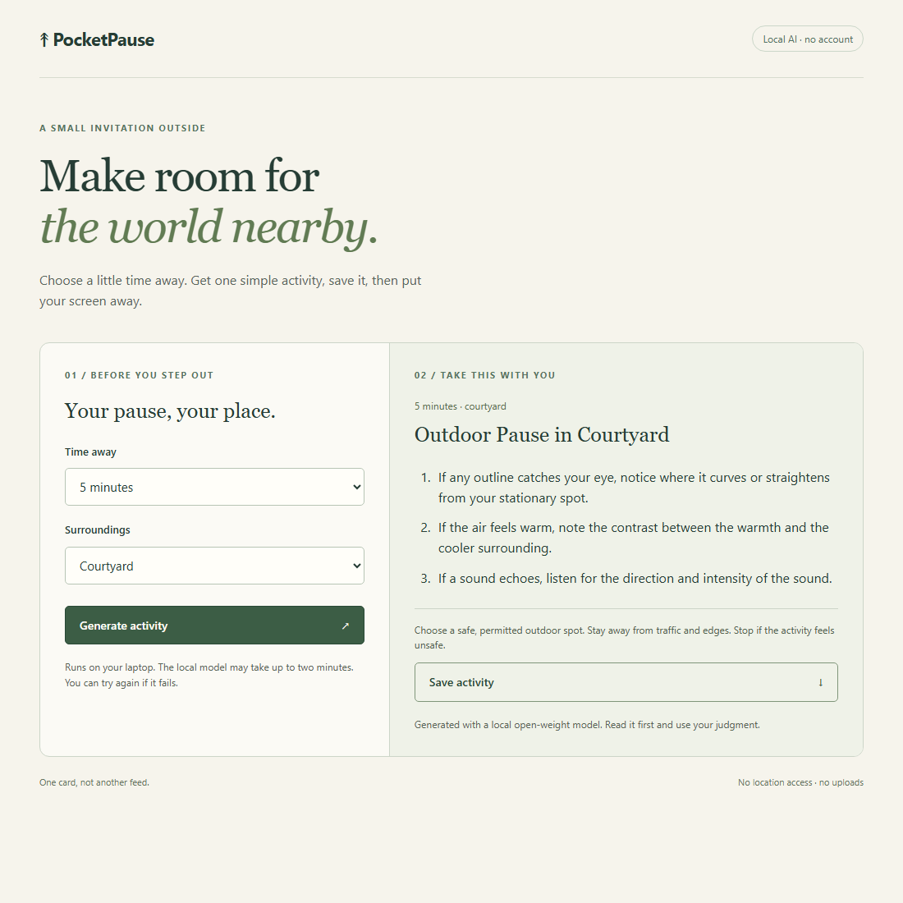

# PocketPause

Choose a short outdoor observation, save the card, then put your screen away.
Select 5, 10 or 15 minutes and street, terrace, courtyard or campus. No bird
recordings, photos, location access or journal entries are needed.



## Run on Windows

Use Node 24.13.0 with npm and Windows x64. Allow about 8 GiB free disk for
the runtime archive, extracted files, weights and optional test browser.
This is a setup allowance, not measured peak disk use. Downloads need
internet; generation uses the downloaded model locally.
Check Node with `node --version` and the prepared runtime with
`npm.cmd run model -- --version`.

This laptop already has the project runtime and weights. From this folder,
start the model in one PowerShell terminal:

```powershell
npm.cmd run model -- serve
```

In another terminal:

```powershell
npm.cmd run build
npm.cmd start
```

Open http://127.0.0.1:3000. Generate, read the card, then Save activity.
The download is plain text, not a phone app or automatic device sync.
Choose a permitted spot yourself and ignore any unsuitable instruction.

## First setup on another machine

Install Node 24.13.0 first. In the repository folder:

```powershell
npm.cmd ci --ignore-scripts --no-fund --no-audit
New-Item -ItemType Directory -Path .tools -Force | Out-Null
curl.exe -fL --retry 2 "https://github.com/ollama/ollama/releases/download/v0.40.0/ollama-windows-amd64.zip" -o .tools/ollama-windows-amd64.zip
if ((Get-FileHash .tools/ollama-windows-amd64.zip -Algorithm SHA256).Hash -ne '3623E256762CA89BD6FA99B0CC4106401919CE9DF926411673E632E3EA287BB5') { throw 'Ollama checksum mismatch' }
Expand-Archive -LiteralPath .tools/ollama-windows-amd64.zip -DestinationPath .tools/ollama-v0.40.0
npm.cmd run model -- serve
```

Leave that terminal running. In a second one, download the public weights once:

```powershell
npm.cmd run model -- pull
npm.cmd run build
npm.cmd start
```

The wrapper confines Ollama's models/profile to ignored project directories
and binds it to 127.0.0.1:11434 with cloud features disabled. It does not
install a service, change global PATH, or connect an account. Do not share
the generated profile or its keys. The standalone download is Windows-only.

Stop each foreground terminal with Ctrl+C. A missing model is an error, not
a fixed-card fallback. If a port is occupied, identify its owner before
starting another service; do not kill an unrelated installation. If output
is rejected, try again. A generation timeout releases the app for retry.
After a failed retry, the previous card remains available to save.

To experiment with another downloaded local model, set
`$env:POCKETPAUSE_MODEL = 'your-local-model:tag'` in the app terminal.
The same variable in the model terminal controls `npm.cmd run model -- pull`.
Other models are unmeasured and must satisfy the same output contract.

## Checks and measurements

```powershell
npm.cmd run typecheck
npm.cmd test
npm.cmd run build
npm.cmd run setup:browser
npm.cmd run test:browser
npm.cmd run smoke
```

Browser setup downloads project-local Chromium. The five browser tests
use controlled API responses and need no model. Smoke uses the real model
and records a local video under .tools/smoke. For development, `npm.cmd run dev`
starts the local API and Vite on port 5173.

An optional measurement run needs a new filename:

```powershell
npm.cmd run evaluate -- my-local-run.json
```

It records raw output, failures, settings, model digest and all 12 combinations.
The fixed picker in scripts/baseline.ts exists only for comparison.

[Measured results](docs/evidence/task-5.md): final warm requests took
12.1–16.5 seconds on the tested i5 laptop, with all 12 valid. The cards are
repetitive; the fixed baseline is clearer and more consistent. Phrase checks
cannot guarantee safety. No outdoor benefit or health effect has been tested.

React renders plain text. The Node server validates choices, limits request
size and accepts one generation at a time. It serves only the built interface
and calls a fixed loopback Ollama endpoint. There is no database, telemetry,
cloud inference or persistent activity history. A saved file stays where
your browser downloads it.

## Submission package

[DEV draft](docs/dev-submission.md), [demo notes](docs/demo.md) and
[outdoor trial](docs/outdoor-trial.md). Public repository/video URLs and the
DEV publication remain pending permission. No hosted CI run is claimed.

Code is MIT licensed. React's licence notice is in
[THIRD_PARTY_NOTICES](THIRD_PARTY_NOTICES.md). Qwen weights and Ollama are
separate downloads; see [their sources](docs/evaluation.md).

Maintainer: Huzaifa Abdul Rehman. If reporting a problem, include the
command, error and runtime versions, never profile keys or credentials.
